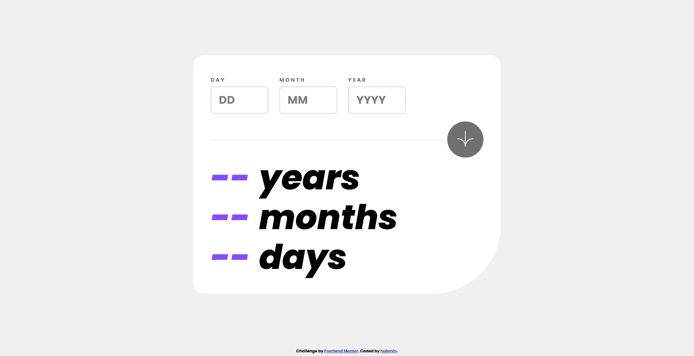
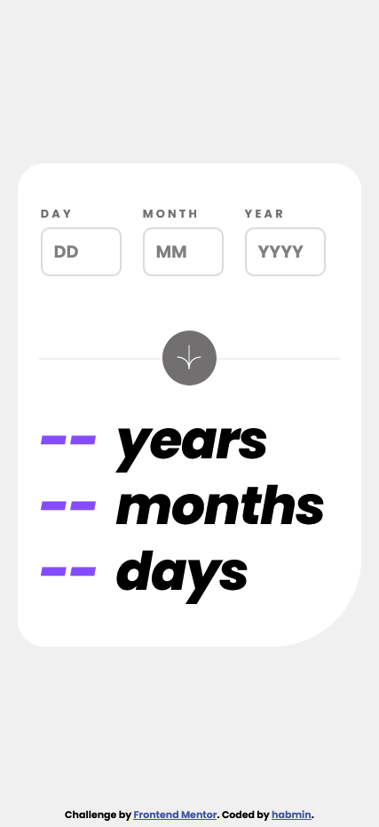

     

*Desktop (left) and Mobile (right) Views*

<h1 align="center">Frontend Mentor - Result Summary Component</h1>

    <h2><a href="https://github.com/habmin/frontend-mentor-age-calculator">Live Link</a> | <a href="#">Solution Link</a></h2>

 

## Table of contents

- [Overview](#overview)
  - [Links](#links)
- [My process](#my-process)
  - [Built with](#built-with)
  - [What I learned](#what-i-learned)
- [Author](#author)

## Overview

This is my implementation of the [Age calculator app on Frontend Mentor](https://www.frontendmentor.io/challenges/age-calculator-app-dF9DFFpj-Q). A basic age calculator app tossed in with some interface animations.

### Links

- Solution URL: [Frontend Mentor](#)
- Live Site URL: [GitHub Pages](https://habmin.github.io/frontend-mentor-age-calculator/)

## My process

I tried to start with mobile first design but found myself going back and forth from mobile to desktop for a while. I'm not sure why I had such a hard time getting the three input boxes to fit evening inside of the container. There was lots of fiddling with padding and margins in both views to try to get it right. In fact, I sort of just accepted how the mobile view came out, even though it isn’t perfect compared to the designs. It fits well enough but doesn't seem exactly as well as I wanted it to be. I’m content with how the desktop came out though.

After setting the stage, I delve into the logic parts, using JavaScript to manage click events and calculations. Figuring out exactly _how_ it should work was tricky, due to how we count years, months, and days differently because of the leap years. But the logic I implemented is this:
- Take the total difference of the current date in milliseconds minus the input date in milliseconds
- Floor divided that difference by the number of milliseconds in a year (1 year/3.15576e10 milliseconds)
- Subtracted those milliseconds from the total difference, then divided that by the number of milliseconds in a month (1 month/2.6298e9 milliseconds)
- For days, I would disregard the milliseconds and would do one of two things
  - If the input day is less or equal than the current day, just subtract current day by input day
  - If not, calculate the days left to the end of the input month, then add them to the current day

Testing with other age calculators may have different results, but because of the way we talk about age is generalized, there are different ways to calculate how days/months have elapsed.

After that, I wanted to include animations to just spiffy it up a bit, including a number scrambling effect and have the arrow animated while it was "working." This was done with just setTimeout() and setInterval() functions, which required planning their time durations/delays manually. A more sophisticated version would be using async/await and Promises, so that when one set of instructions for an animation is complete, another would start. But this was simple enough to just do it manually for now.

### Built with

- Semantic HTML5 markup & CSS
- ES6 JavaScript (Vanilla)
- Flexbox

### What I learned

Became more aquainted with responsive designing, and some flex-box positioning, though still not quite as intuitive as I want it to be. Still, felt more like I was crafting with CSS than fighting with CSS. 

## Author

- Henry Andrew Baum ([habmin](https://github.com/habmin))
